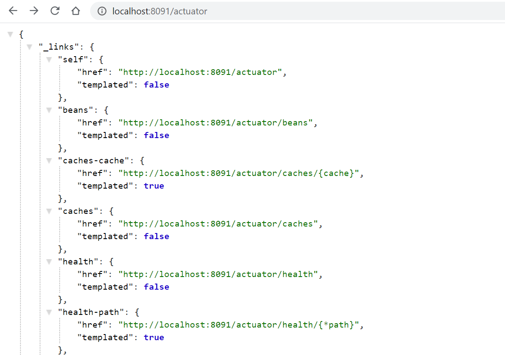
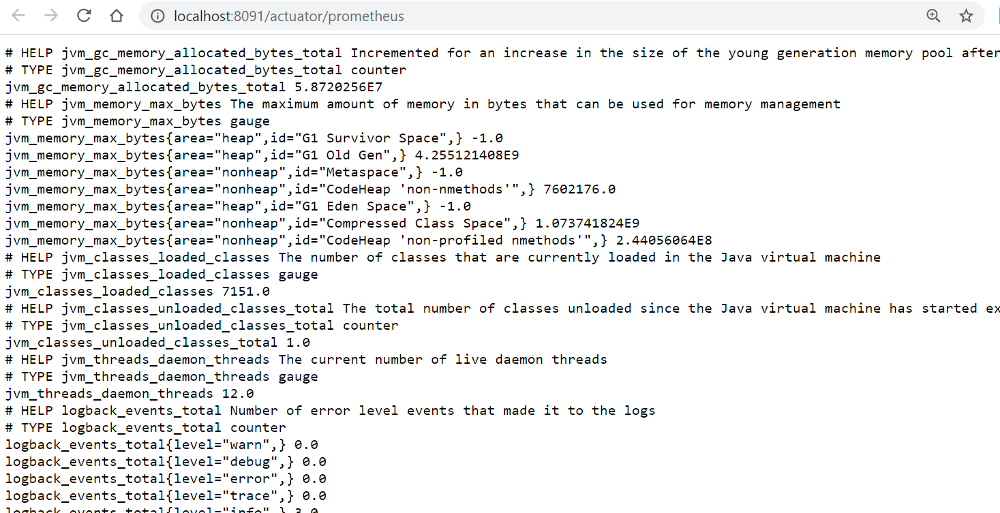
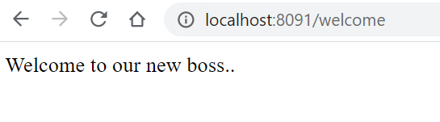
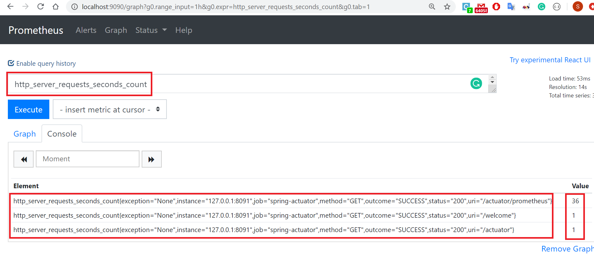
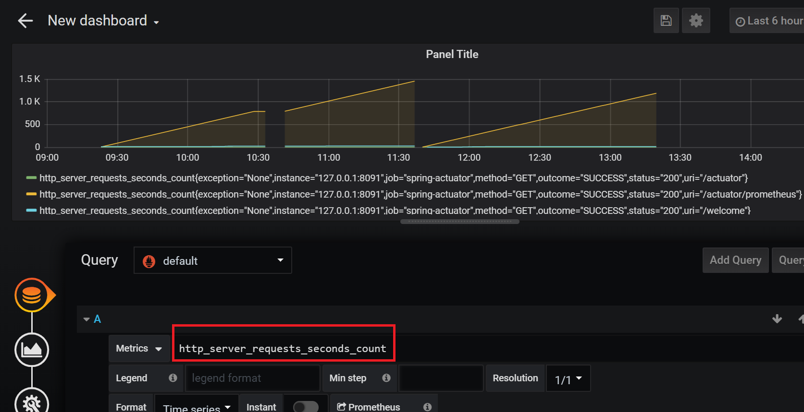

# Objective:

The objective of this project is to set up basic Spring boot monitoring project and integrate with Prometheus (to scrape the metrics) and Grafana (to visualize the output in graphs). 

# Pre-requsites:
The following softwares are to be installed on your machine for this code to work:
* JDK 11 or Open JDK 11
* Gradle 4.10 and above

# Instructions for the setup:

* Git clone the project
* Open Command prompt and go to the root directory path (/springboot-micrometer-monitoring) and run the following command, which will pull the Prometheus and Grafana docker image and run the same
```
docker-compose up
```
* Open another Command prompt and go to the root directory path (/springboot-micrometer-monitoring) and run the following command, which will start the application
```
gradlew bootRun
```
* Now open the Browser (or any rest client like Postman) and invoke the following URL to see various actuator endpoints (as shown in the screen shot below)
```
http://localhost:8091/actuator
``` 

* Now open another Browser (or any rest client like Postman) and invoke the following URL to see Prometheus health metrics
```
http://localhost:8091/actuator/prometheus
``` 

* Now open Browser (or any rest client like Postman) and invoke the following URL to see the output of sample endpoint
```
http://localhost:8091/welcome
``` 


* Now open Browser (or any rest client like Postman) and invoke the following URL to see the output of Prometheus console. Type "http_server_requests_seconds_count" in the text box and click "Execute" button which will show all the 3 endpoints (/actuator/prometheus, /welcome, /actuator) and their value indicating how many times these API's were invoked.
```
http://localhost:9090/graph
``` 


* Follow the below steps in the same order:
    * Now open Browser (or any rest client like Postman) and invoke the following URL to see the output of Grafana login screen. 
    * Enter the default user id and password as "admin". 
    * Once logged-in to home page, click the icon "Create a data source", click the "Select" button next to "Prometheus", enter the URL value as "http://localhost:9090/", click "Save & Test" button where you will get a confirmation in green background saying "Datasource updated". 
    Note: Incase if your Prometheus is running on different machine (than localhost), please use the appropriate IP Address in the URL like this http://<IP>:9090
    * On the left hand side, click + (the first menu option) and Dashboard in the submenu. 
    * Click "Choose Visualization", select "Graph", in the "Query" tab, under "Metrics", enter the PromQL - http_server_requests_seconds_count and then the following similar screen shot will be visible.
    * Type "http_server_requests_seconds_count" in the text box and click "Execute" button which will show all the 3 endpoints (/actuator/prometheus, /welcome, /actuator) and their value indicating how many times these API's were invoked.
```
http://localhost:3000/dashboard
``` 


# References:
* If you want to know more about Prometheus and Grafana, please refer the below links:
```
https://prometheus.io/
https://grafana.com/
```
